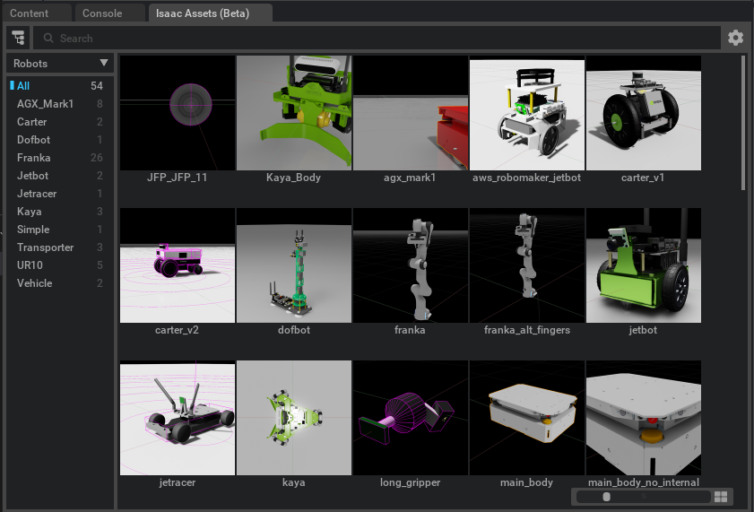

..
    This file was auto-generated by the 'repo_extension_docs' tool.
    Run 'repo extension_docs --help' for more details.

..
    [begin reference autogenerated]

.. _ext_isaacsim_asset_browser:

..
    [end reference autogenerated]

..
    [begin title autogenerated]

[isaacsim.asset.browser] Isaac Sim Asset Browser
################################################

..
    [end title autogenerated]

..
    [begin deprecation autogenerated]
..
    [end deprecation autogenerated]

..
    [begin version autogenerated]

**Version**: :guilabel:`1.3.4`

..
    [end version autogenerated]

..
    [begin description autogenerated]

The Isaac Sim Asset Browser extension provides an user interface for loading isaac sim assets and files.

..
    [end description autogenerated]

..
    [begin preview autogenerated]

..
    [end preview autogenerated]

..
    [begin enable-extension autogenerated]

Enable Extension
================

The extension can be enabled (if not already) in one of the following ways:

.. tab-set::
    .. tab-item:: Command-line interface
        :sync: tab_cli

        Define the next entry as an application argument from a terminal.

        .. code-block:: bash

            APP_SCRIPT.(sh|bat) --enable isaacsim.asset.browser

    .. tab-item:: Experience/extension configuration
        :sync: tab_toml

        Define the next entry under ``[dependencies]`` in an experience (``.kit``) file or an extension configuration (``extension.toml``) file.

        .. code-block:: ini

            [dependencies]
            "isaacsim.asset.browser" = {}

    .. tab-item:: Extension Manager UI
        :sync: tab_gui

        Open the *Window > Extensions* menu in a running application instance and search for ``isaacsim.asset.browser``.
        Then, toggle the enable control button if it is not already active.

..
    [end enable-extension autogenerated]

..
    [begin usage autogenerated]
..
    [end usage autogenerated]

..
    [begin api autogenerated]
..
    [end api autogenerated]

..
    [begin ogn autogenerated]
..
    [end ogn autogenerated]

..
    [begin settings autogenerated]

Settings
========

Extension Settings
------------------

The table list the extension-specific settings.

.. list-table::
    :header-rows: 1

    * - Setting name
      - Description
      - Type
      - Default value
    * - ``folders``
      - Root folder URLs to list and monitor.

      - ``list``
      - ``['https://omniverse-content-production.s3-us-west-2.amazonaws.com/Assets/Isaac/4.5/Isaac/Robots', 'https://omniverse-content-production.s3-us-west-2.amazonaws.com/Assets/Isaac/4.5/Isaac/Environments', 'https://omniverse-content-production.s3-us-west-2.amazonaws.com/Assets/Isaac/4.5/Isaac/IsaacLab', 'https://omniverse-content-production.s3-us-west-2.amazonaws.com/Assets/Isaac/4.5/Isaac/Materials', 'https://omniverse-content-production.s3-us-west-2.amazonaws.com/Assets/Isaac/4.5/Isaac/People', 'https://omniverse-content-production.s3-us-west-2.amazonaws.com/Assets/Isaac/4.5/Isaac/Props', 'https://omniverse-content-production.s3-us-west-2.amazonaws.com/Assets/Isaac/4.5/Isaac/Samples', 'https://omniverse-content-production.s3-us-west-2.amazonaws.com/Assets/Isaac/4.5/Isaac/Sensors']``
    * - ``instanceable``
      - List of asset categories that can be dragged from the browser to the viewport window.

      - ``list``
      - ``[]``
    * - ``data.timeout``
      - Number of seconds to wait for the folder to be listed/read from.

      - ``int``
      - ``10``
    * - ``data.filter_file_suffixes``
      - Filter for USD Types only

      - ``list``
      - ``['.usd', '.usda', '.usdc', '.usdz']``
    * - ``data.hide_file_without_thumbnails``
      - Use only assets with thumbnail

      - ``bool``
      - ``True``
    * - ``visible_after_startup``
      - Whether the browser window is visible when the extension starts up.

      - ``bool``
      - ``True``

The extension-specific settings can be either specified (set) or retrieved (get) in one of the following ways:

.. tab-set::
    .. tab-item:: Set setting

        .. tab-set::
            .. tab-item:: Command-line interface
                :sync: tab_cli

                Define the key and value of the setting as an application argument from a terminal.

                .. code-block:: bash

                    APP_SCRIPT.(sh|bat) --/exts/isaacsim.asset.browser/SETTING_NAME=SETTING_VALUE

            .. tab-item:: Experience/extension configuration
                :sync: tab_toml

                Define the key and value of the setting under ``[settings]`` in an experience (``.kit``) file or an extension configuration (``extension.toml``) file.

                .. code-block:: ini

                    [settings]
                    exts."isaacsim.asset.browser".SETTING_NAME = SETTING_VALUE

            .. tab-item:: By programming
                :sync: tab_carb

                Define the key and value of the setting using the carb framework (in Python).

                .. code-block:: python

                    import carb

                    settings = carb.settings.get_settings()
                    settings.set("/exts/isaacsim.asset.browser/SETTING_NAME", SETTING_VALUE)

    .. tab-item:: Get setting

        .. tab-set::
            .. tab-item:: By programming
                :sync: tab_carb

                Define the key to query the value of the setting using the carb framework (in Python).

                .. code-block:: python

                    import carb

                    settings = carb.settings.get_settings()
                    value = settings.get("/exts/isaacsim.asset.browser/SETTING_NAME")

..
    [end settings autogenerated]
